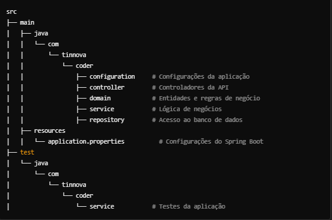

# Serviço de Veículos - API Restful

Este é um serviço de gerenciamento de veículos implementado utilizando a arquitetura DDD (Domain-Driven Design) e organizado com base nos princípios da Clean Architecture. A API permite operações CRUD (Create, Read, Update, Delete) para gerenciar dados relacionados aos veículos, como marca, ano e cor.

## Arquitetura


A arquitetura do sistema segue os princípios do **DDD** (Domain-Driven Design) e é organizada de forma a promover o desacoplamento das responsabilidades do sistema. As camadas principais são:

- **controller**: Contém os controladores responsáveis pela interação com as requisições HTTP.
- **domain**: Representa o domínio da aplicação, incluindo as entidades e regras de negócio.
- **service**: Implementação da lógica de negócios que manipula as entidades.
- **repository**: Interface entre o domínio e a base de dados, responsável pelas operações de persistência.
- **configuration**: Configurações da aplicação, como a configuração do banco de dados e inicialização dos serviços.

## Setup do Projeto

### Pré-requisitos

Certifique-se de ter os seguintes softwares instalados:

- **Docker**: Para containerizar e rodar o banco de dados.
- **Docker Compose**: Para orquestrar containers.
- **Java 17**: A aplicação é construída com Java 17.
- **Maven 3.9+**: Para gerenciamento de dependências e build.
- **Postman**: Para testar a API via requisições HTTP.

### Passos para Rodar a Aplicação

1. **Clonar o repositório**:
   ```bash
   git clone https://github.com/yourusername/veiculos-api.git

2. **Rodar o Banco de Dados com Docker**:

   Dentro da pasta do projeto, execute o seguinte comando para rodar o PostgreSQL no Docker:

   ```bash
   docker-compose up -d

Este comando irá iniciar o banco de dados PostgreSQL com as configurações do docker-compose.yml.

### Configuração do Maven:

Certifique-se de que você tem o Maven instalado.
Navegue até a pasta do projeto e execute o seguinte comando para compilar a aplicação:
```bash
mvn clean install
```
Logo em seguida:
```bash
mvn spring-boot:run
```

### Acessando documentação no Swagger:

A API estará disponível em http://localhost:8080/documentacao.

### Testando a API com Postman:

Para testar os endpoints da API, use o Postman. O arquivo de coleções do Postman pode ser encontrado na pasta Postman_Collections em resources.

### Estrutura do Projeto
A estrutura do projeto segue os princípios da Clean Architecture, com as seguintes pastas e responsabilidades:




### Descrição das Pastas

- **configuration**: Contém as classes de configuração, como a configuração do banco de dados e da camada de persistência.
- **controller**: Onde os controladores REST da aplicação são definidos. Eles são responsáveis por lidar com as requisições HTTP.
- **domain**: Define as entidades e regras de negócio. Contém a parte central da aplicação.
- **service**: Lógica de negócios, onde as regras de manipulação dos dados das entidades são executadas.
- **repository**: Responsável pela comunicação com o banco de dados, realizando as operações CRUD.
- **exercícios**: Os exercícios propostos no projeto podem ser encontrados dentro da pasta `exercicios`. Cada exercício está dentro de sua respectiva pasta, e deve ser seguido o passo a passo de implementação de acordo com as instruções fornecidas.
